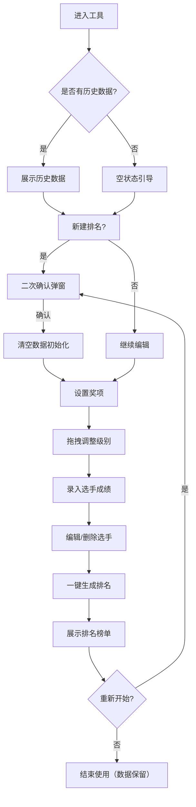

# 比赛获奖排名工具 - 产品需求文档（PRD）

## 1. 产品概述

一款轻量级、免注册、开箱即用的赛事获奖排名工具，面向短时评比场景（知识竞赛、文体比赛、内部评比等）。所有数据本地存储，无服务端上传，移动端优先设计，满足「用完即走」的轻量化使用需求。

- 目标用户：小型赛事组织者、班级/社团活动负责人、线下评比工作人员等非专业技术用户
- 核心价值：效率提升（一键生成排名）、隐私安全（localStorage 本地存储）、低使用成本（无注册、移动端优先）

## 2. 核心功能

### 2.1 功能模块

单页流式交互，无强制页面跳转：

1. **项目管理模块**：新建排名（二次确认清空）、本地自动持久化（localStorage）、单项目模式
2. **奖项配置模块**：奖项名称与名额配置、拖拽式级别排序（PC 鼠标 + 移动端触屏）、奖项增删（删除二次确认）、合法性校验
3. **成绩录入模块**：单条快速录入（姓名 + 分数，回车快捷提交）、选手列表管理（编辑/删除）、录入校验
4. **排名与获奖计算模块**：分数从高到低自动排名、同分并列名次顺延、按奖项级别从高到低匹配、边界场景处理
5. **结果展示模块**：总排名榜单（名次/姓名/分数/奖项）、获奖视觉区分（标签高亮配色）、榜单交互（排序切换、长按复制）

### 2.2 页面详情

| 页面区块 | 模块名称 | 功能描述 |
|---------|---------|---------|
| 顶部导航 | 项目管理 | 新建排名按钮（二次确认弹窗）、应用标题 |
| 奖项配置区 | 奖项列表 | 拖拽排序卡片、新增/删除奖项、名称与名额输入、合法性校验 |
| 奖项配置区 | 操作区 | 生成结果按钮、切换至成绩录入 |
| 成绩录入区 | 录入表单 | 姓名 + 分数输入框、回车快捷提交、Toast 校验提示 |
| 成绩录入区 | 选手列表 | 列表展示、单条编辑/删除、空状态提示 |
| 结果展示区 | 排名榜单 | 名次/姓名/分数/奖项标签、排序切换、长按复制 |
| 结果展示区 | 统计概览 | 总人数、获奖人数、奖项名额概览 |

## 3. 核心流程

用户操作链路：新建排名 → 设置奖项（拖拽排序）→ 录入成绩 → 生成结果 → 结束使用。

## 4. 用户界面设计

### 4.1 设计风格

极简现代风格，界面干净克制，信息层级清晰，核心操作路径扁平化。

- **主色调**：单一主色（深邃靛蓝 #3B5BDB 作为主操作色），中性色基底（#F8F9FA 背景 / #212529 主文字）
- **辅助色**：奖项级别配色采用低饱和度渐变（金/银/铜 + 低饱和度彩虹色系），未获奖灰色提示
- **按钮风格**：圆角 12px，主按钮带轻量投影 + 按压态反馈，次按钮描边样式
- **字体**：无衬线字体体系（系统字体栈优先 PingFang SC / Microsoft YaHei），标题/正文/辅助文字层级清晰
- **布局**：移动端单列卡片式布局，PC 端居中容器最大宽度 480px 模拟移动端体验
- **圆角规范**：卡片/按钮/输入框 12px，小标签/徽标 8px
- **阴影体系**：分层柔和阴影，卡片低不透明度悬浮阴影，按钮轻量投影，悬停/点击通过阴影深浅变化体现

### 4.2 页面设计概览

| 页面区块 | 模块名称 | UI 元素 |
|---------|---------|---------|
| 顶部导航 | 标题栏 | 应用名称 + 新建排名按钮（红色描边），吸顶 sticky 布局 |
| 奖项配置 | 奖项卡片 | 拖拽手柄 + 级别序号徽标 + 名称输入 + 名额输入 + 删除按钮，渐变左边框区分级别 |
| 成绩录入 | 录入表单 | 双列输入框（姓名/分数）+ 提交按钮，分数 inputMode=decimal |
| 成绩录入 | 选手列表 | 行式列表，左姓名右分数，操作按钮淡入显示 |
| 结果展示 | 榜单卡片 | 前三名特殊样式（金银铜色边框 + 奖牌图标），奖项标签彩色徽标 |
| 全局 | Toast 提示 | 顶部下滑式轻提示，2s 自动消失，不阻塞操作 |

### 4.3 响应式

- **移动端优先**：核心适配目标 360px~430px，所有可点击元素 ≥ 44×44px
- **平板/PC 端**：居中容器最大宽度 480px，两侧留白，无布局错乱
- **触摸交互**：拖拽支持触屏长按触发，拖拽过程占位提示与吸附效果
- **键盘适配**：分数输入唤起数字键盘（inputMode=decimal），输入框不被键盘遮挡

## 5. 非功能需求

- **性能**：首屏加载 ≤ 1s，支持 1000 条选手数据无卡顿，动画帧率稳定
- **数据隐私**：全量数据 localStorage 本地存储，无服务端上传，无账号体系
- **兼容性**：iOS Safari 14+、Android Chrome 80+、微信/QQ 浏览器、Chrome/Edge/Firefox
- **技术栈**：Flask（仅静态托管）+ 原生 HTML5/CSS3/JS（ES6+），无第三方依赖
