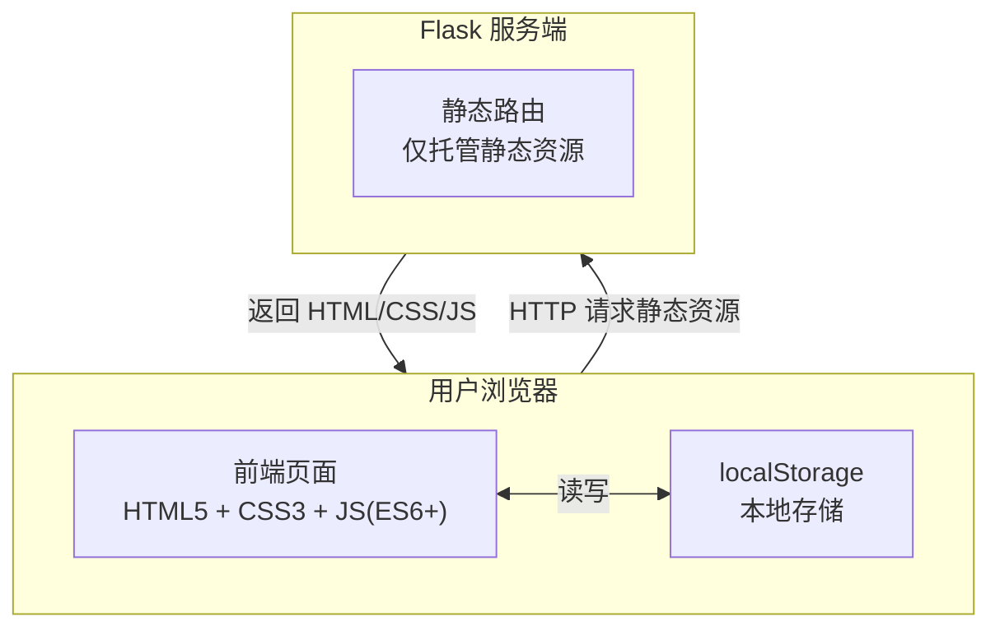

# 比赛获奖排名工具 - 技术架构文档

## 1. 架构设计



服务端零业务逻辑、零数据库，仅作为轻量 HTTP 服务托管静态资源。所有业务计算与数据存储完全在前端浏览器完成。

## 2. 技术说明

- **前端**：原生 HTML5 + CSS3 + JavaScript（ES6+），无任何第三方依赖
  - 模块化拆分：业务逻辑层（store/ranking）、视图层（render）、交互层（drag/toast）分离
  - CSS 变量管理统一设计规范
- **后端**：Flask（Python），仅提供静态页面路由与资源托管，无业务逻辑、无数据库
- **数据存储**：浏览器 localStorage，存储奖项配置列表与选手成绩列表
- **初始化工具**：手动创建项目结构，pip install flask

## 3. 项目结构

```
/workspace/
├── app.py                      # Flask 应用入口（静态资源托管）
├── requirements.txt            # Python 依赖（flask）
├── README.md                   # 部署与使用说明
├── .trae/
│   └── documents/              # 需求与技术文档
└── static/
    ├── index.html              # 单页应用入口
    ├── css/
    │   └── style.css           # 全局样式（CSS 变量 + 响应式）
    └── js/
        ├── app.js              # 应用入口与模块协调
        ├── store.js            # 数据存储层（localStorage 封装）
        ├── ranking.js          # 排名与获奖计算逻辑
        ├── render.js           # 视图渲染层
        ├── drag.js             # 拖拽排序交互（PC + 触屏）
        └── toast.js            # 轻量 Toast 提示
```

## 4. 路由定义

| 路由 | 方法 | 用途 |
|------|------|------|
| `/` | GET | 返回 index.html 单页应用 |
| `/static/<path>` | GET | 静态资源托管（CSS/JS） |

## 5. 数据模型

### 5.1 localStorage 数据结构

```javascript
// 奖项配置列表（按级别从高到低排序）
// key: "ranking_awards"
[
  { "id": "uuid", "name": "一等奖", "quota": 1 },
  { "id": "uuid", "name": "二等奖", "quota": 2 },
  { "id": "uuid", "name": "三等奖", "quota": 3 }
]

// 选手成绩列表（录入顺序）
// key: "ranking_players"
[
  { "id": "uuid", "name": "张三", "score": 95.5 },
  { "id": "uuid", "name": "李四", "score": 88.0 }
]
```

### 5.2 排名计算逻辑

```javascript
// 1. 按分数降序排序
// 2. 计算名次：同分并列，后续顺延（如两位并列第1，下一位为第3）
// 3. 按奖项级别从高到低匹配：
//    - 维护奖项名额指针，按排名顺序依次消耗名额
//    - 同分跨边界：并列名次统一分配对应奖项，名额不足顺延
//    - 名额用尽后剩余选手标注「未获奖」
// 4. 输出：[{ rank, player, award }]
```

## 6. 关键交互实现

### 6.1 拖拽排序

- **PC 端**：mousedown / mousemove / mouseup 事件链
- **移动端**：touchstart / touchmove / touchend 事件链，长按 150ms 触发拖拽
- **视觉反馈**：拖拽项半透明 + 占位符虚线框 + 吸附效果（translateY 平滑过渡）
- **数据同步**：拖拽完成实时更新数组顺序并持久化至 localStorage

### 6.2 移动端键盘适配

- 分数输入框 `inputmode="decimal"` 唤起数字键盘
- 表单聚焦时 `scrollIntoView({ block: 'center' })` 防止键盘遮挡
- 回车键提交表单（keydown 监听 Enter）

### 6.3 Toast 提示

- 顶部下滑式动画（transform translateY + opacity）
- 2 秒自动消失，支持多次叠加（队列管理）
- 不阻塞用户操作（pointer-events: none）
